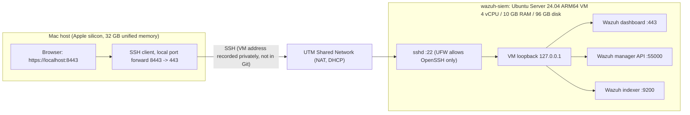
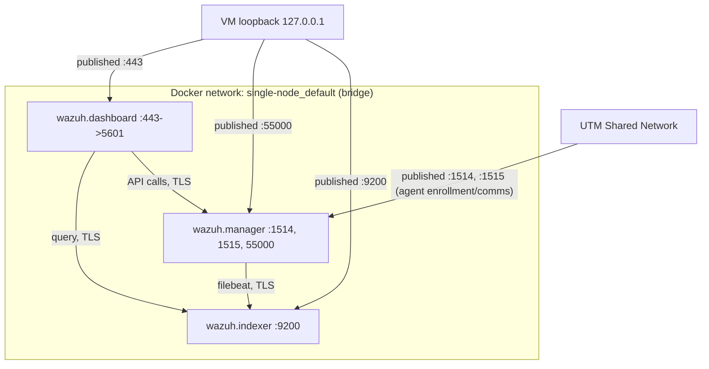

# Network & Architecture

> Status: **Deployed.** Reflects the running stack on the `wazuh-siem` VM.
> Uses placeholder addresses only; no real host or network details are
> recorded in this repo.

## Mac to VM access path

The Wazuh dashboard is published on the VM's loopback address only. The Mac
reaches it through an SSH tunnel, so no dashboard, API or indexer port is
open on the VM's network interface.

No Bridged adapter exists. The VM is not reachable from the wider home LAN.
Docker published ports bypass UFW, so the safeguard is the `127.0.0.1` bind
address in `docker-compose.yml`, not a firewall rule.

## Docker Compose network (inside the VM)

## Port exposure summary

| Port | Purpose | Binding |
| --- | --- | --- |
| 443 | Dashboard (web UI) | `127.0.0.1` only |
| 55000 | Manager API | `127.0.0.1` only |
| 9200 | Indexer API | `127.0.0.1` only |
| 1514, 1515 | Agent event and enrollment ports | Open on the VM's Shared Network interface (accepted risk, see [Security Decisions](security-decisions.md)) |
| 514/udp | Syslog input | Removed; not used in this lab |

## Known limitation

Certificate hostname verification is disabled (`-nhnv`) for the internal
`securityadmin.sh` administration step, because the indexer's certificate is
issued for the hostname `wazuh.indexer`, not for `127.0.0.1`. This only
affects that one internal maintenance command, run from inside the VM over
the private Docker network; it does not weaken the TLS between containers or
between the browser and the dashboard.
